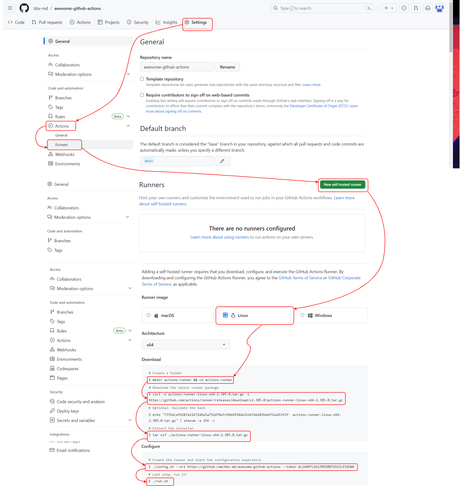
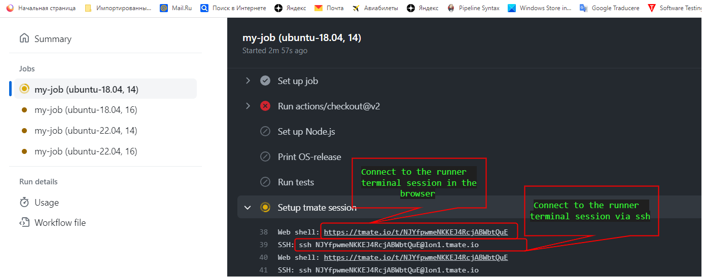
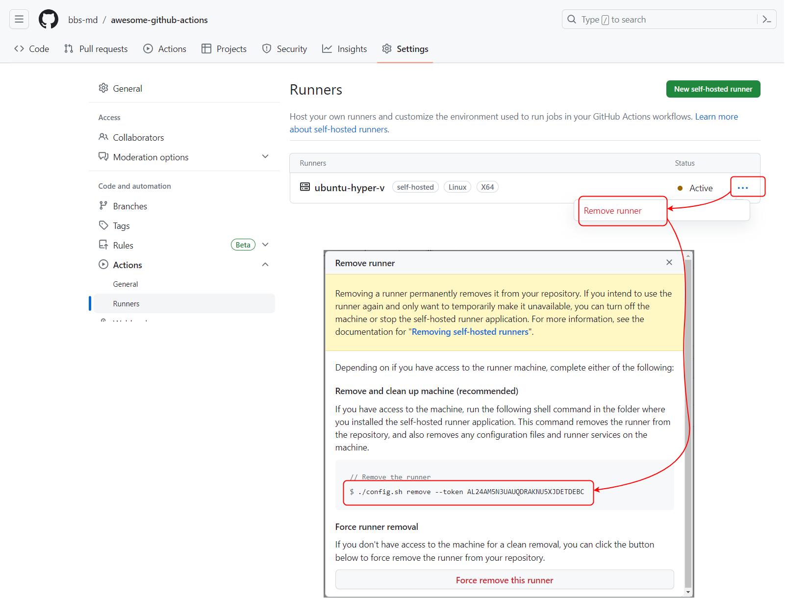

# Awesome GitHub Actions

This repository serves as a comprehensive collection of GitHub Actions workflows examples. 
It provides a variety of workflow configurations that demonstrate different use cases and 
best practices for automating CI/CD processes using GitHub Actions. Each 
example includes a name for the workflow, a list of trigger events, and a set of jobs. Each 
job contains a list of steps that execute in order when the job runs. These steps may access
 environment variables, conditions, expressions, and secrets to perform various actions, 
 such as checking out the source repository, running scripts, and setting up a tmate session
 for debugging purposes. Examples cover different areas of functionality, such as job 
 matrix, parallel jobs, job ordering, context variables, expression evaluation, outputting 
 variables, and event triggers.

 # Self-hosted runners

 A runner is a server that runs your workflows when they're triggered. Each runner can run a single job at a time. GitHub provides Ubuntu Linux, Microsoft Windows, and macOS runners to run your workflows; each workflow run executes in a fresh, newly-provisioned virtual machine. If you need a different operating system or require a specific hardware configuration, you can host your [own runners](https://docs.github.com/en/actions/hosting-your-own-runners/managing-self-hosted-runners/about-self-hosted-runners).
 A self-hosted runner is a system that you deploy and manage to execute jobs from GitHub Actions on GitHub.com. 

## Prerequisites:

  ### 1. Create VMs to use as a self-hosted runners

  - To create VMs in `Proxmox` use [scripts](https://github.com/Alliedium/awesome-proxmox/tree/main/vm-cloud-init-shell#vm-provisioning-scripts-based-on-cloud-init-images)

  - To create VMs in `Hyper-V` use [steps](https://github.com/Alliedium/awesome-devops/tree/main/03_virtualization_on_windows_and_zfs_11-aug-2022#create-vms-in-hyper-v)

  ### 2. Install `docker` if you want to run workflow jobs in containers

  -  [`Manjaro`](https://github.com/Alliedium/awesome-linux-config/blob/master/manjaro/basic/install_docker.sh)

  -  [Ubuntu](https://docs.docker.com/engine/install/ubuntu/)


  ### 3. Install [tmate](https://tmate.io/) for debugging

 
## Repository-level runners

### 1. Create fork from the [main repository](https://github.com/Alliedium/awesome-github-actions)


### 2. Clone [project](https://github.com/Alliedium/awesome-github-actions)

```
git clone https://github.com/bbs-md/awesome-github-actions.git $HOME/awesome-github-actions
```

### 3. Add self-hosted Linux runner to `GitHub` repository.



Run commands on `runner` Linux VM

- Create a `actions-runner` folder

```
mkdir actions-runner && cd actions-runner
```

- Download the latest runner package

```
curl -o actions-runner-linux-x64-2.305.0.tar.gz -L https://github.com/actions/runner/releases/download/v2.305.0/actions-runner-linux-x64-2.305.0.tar.gz
```

- Extract the installer

```
tar xzf ./actions-runner-linux-x64-2.305.0.tar.gz
```

- Create the runner and start the configuration experience

```
./config.sh --url https://github.com/bbs-md/awesome-github-actions --token AL24AM7L6GS3RRSBBTGSSILESXOW6
```

- run it!

```
./run.sh
```

### 3. Add self-hosted Windows runner to `GitHub` repository.

- In `Windows` machine open `PowerShell`
- Create a folder under the drive root

```
mkdir actions-runner; cd actions-runner
```

- Download the latest runner package

```
Invoke-WebRequest -Uri https://github.com/actions/runner/releases/download/v2.305.0/actions-runner-win-x64-2.305.0.zip -OutFile actions-runner-win-x64-2.305.0.zip

```

- Extract the installer

```
Add-Type -AssemblyName System.IO.Compression.FileSystem ; [System.IO.Compression.ZipFile]::ExtractToDirectory("$PWD/actions-runner-win-x64-2.305.0.zip", "$PWD")
```

- Create the runner and start the configuration experience

```
./config.cmd --url https://github.com/bbs-md/awesome-github-actions --token AL24AM56SRAXQCYI7PF7KW3ES5ILY
```


- Run it!

```
./run.cmd
```

- Use this YAML in your workflow file for each job
  
```
runs-on: self-hosted
```

### 3. Add self-hosted docker runner to `GitHub` repository.

- Navigate to `awesome-github-actions/07-job-matrix/` folder

```
cd $HOME/awesome-github-actions/07-job-matrix
```

- Build `docker` image


```
docker build -t runner:0.1 \
	--build-arg REPO_URL=https://github.com/bbs-md/awesome-github-actions \
	--build-arg TOKEN='AL24AMZNNIJVECQ34ANMH23ESNYCW' \
    --build-arg LABELS='ubuntu-18.04' \
    --build-arg RUNNER_NAME='docker-runner' \
    -f $HOME/awesome-github-actions/07-job-matrix/Dockerfile \
    $HOME/awesome-github-actions/07-job-matrix
 ```

- Run `docker` image

```
docker run --name runner -d runner:0.1
```

### 4. Run workflow jobs on Linux runners

For our runner examples we used the `$HOME/awesome-github-actions/.github/workflows/07-job-matrix.yml` file.

Copy `$HOME/awesome-github-actions/07-job-matrix/workflows/self-hosted-wf.yml` file content to `$HOME/awesome-github-actions/.github/workflows/07-job-matrix.yml` file.

Workflow will execute on any runner that matches all of the specified runs-on values
This `runs-on: [ self-hosted, Linux ]` matches all Linux runners.

As you can see, the job runs on any Linux runner, regardless of the version of the Linux distribution specified in the job

### 5. Run workflow jobs on Linux runners that match distribution version, specified in job.

Copy `$HOME/awesome-github-actions/07-job-matrix/workflows/self-hosted-labels-wf.yml` file content to `$HOME/awesome-github-actions/.github/workflows/07-job-matrix.yml` file.

The job runs on a runner that matches the version of the Linux distribution specified in the job

### 6. Run workflow jobs in containers on Linux runners on which the docker is installed

Copy `$HOME/awesome-github-actions/07-job-matrix/workflows/self-hosted-containers-wf.yml` file content to `$HOME/awesome-github-actions/.github/workflows/07-job-matrix.yml` file.

### 7. Debugging running workflow

[Tmate](https://chat.openai.com/) is a terminal sharing software that allows users to share their command-line interface (CLI) sessions with others over the internet. 
Copy `$HOME/awesome-github-actions/07-job-matrix/workflows/self-hosted-labels-tmate-wf.yml` file content to `$HOME/awesome-github-actions/.github/workflows/07-job-matrix.yml` file.

```
cp $HOME/awesome-github-actions/07-job-matrix/workflows/self-hosted-labels-tmate-wf.yml $HOME/awesome-github-actions/.github/workflows/07-job-matrix.yml
```

This workflow will fail because running `npm test` without `npm ci`.
`Tmate` will pause the job and establish a terminal session with the runner.



Fix the issue in terminal. 
To exit the terminal, create a file with `continue` name.

### 8. Deleting running from repo



Navigate to `actions-runner` folder and in Runner terminal run command

```
./config.sh remove --token AL24AM5N3UAUQDRAKNU5XJDETDEBC
```